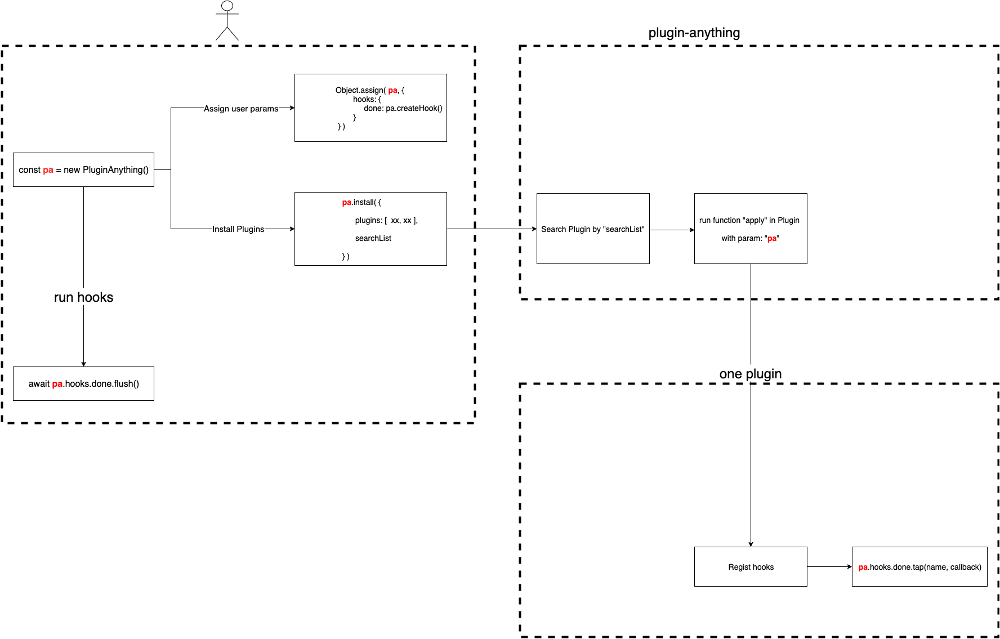

# Inroduction

Make pluginable applications.

# How does it work ?



# Demo

```js
const { PluginAnything } = require('plugin-anything');

class MyPlugin__A {
    constructor(options) {
        console.log('my plugin A options', options);
    }

    apply(pa) {
        const { myHooks, myUtils } = pa;

        myHooks.done.tap('my plugin A', async (data) => {
            console.log('my plugin A hook run', data);

            return 'a';
        });
    }
}

class MyPlugin__B {
    constructor(options) {
        console.log('my plugin B options', options);
    }

    apply(pa) {
        const { myHooks, myUtils } = pa;

        myHooks.done.tap('my plugin B', async (data) => {
            console.log('my plugin B hook run', data);
        });
    }
}

function initHooks() {
    const pa = new PluginAnything();

    // init anything into pa
    Object.assign(pa, {
        myUtils: {
            aaa: 1
        },
        myHooks: {
            start: pa.createHook(),
            done: pa.createHook(),
        }
    });

    // install plugins
    const plugins = pa.install({
        // Array< string | FunctionContructor | Array<string | FunctionContructor, object> >
        plugins: [
            MyPlugin__A,
            [ MyPlugin__B, { name: 'b__1' } ],
            new MyPlugin__B({ name: 'b__2' }),
        ],

        // search plugins when plugin name is string
        // Array< string >; Array item should be absolute folder path
        searchList: [],
    });

    return pa;
}

// run events defined in plugins
(async () => {
    const pa = initHooks();
    await pa.myHooks.done.flush();
})();
```

```bash
# because of `new MyPlugin__C({ name: 'ccc' })` runs first
my plugin C options { name: 'ccc' }
my plugin A options {}
my plugin B options { name: 'bbb' }

# event 'done' callbacks
my plugin A hook run undefined
my plugin B hook run a
my plugin C hook run undefined
```

## APIs

```js
const pa = new PluginAnything(options: { [name: string]: any });
```

+   `options.searchList`: Array< string >

    Absolute folder path list that will be used in searching plugins.

    examples:

    ```js
    [
        '/path_a/node_modules',
        '/path_b/node_modules'
    ]
    ```

+   `options.plugins: Array< string | FunctionContructor | { apply(data?: any): any; [ name: string ]: any } | Array<string | FunctionContructor, object> >`

    ```ts
    class MyPlugin {
        constructor(options) {
            this.options = options;
        };

        options: {};

        apply(pa) {

        }
    }


    // config demo
    {
        plugins: {
            'my-plugin-0',

            [ 'my-plugin-1', { params: 1 } ],

            [ MyPlugin, { params: 2 } ],

            new MyPlugin({ params: 2 })
        }
    }
    ```

+   `pa.install(): Array<{ [name: string]: any }>`

    Install plugins and return plugin list.

+   `pa.createHook()`

    ```ts
    const hook = createHook();
    ```

    create a hook.

    +   `hook.tap(name: string, callback: Function | Promise<any>)`

        Add callback at current hook event.

        `name` could be any string for event description.

    +   `hook.untap(name?: string)`

        Remove callback list whose name equals `name`.

        When `name` is blank, clear callback list.

    +   `hook.flush(type?: sync | waterfall | paralle, initData?: any, paralleLimit = 3)`

        Run all callbacks.

        +   `sync` (default)

            run callbacks one next one.

        +   `waterfall`

            run callbacks one next none.

            and previous returned value will be parameter of next callback.

        +   `paralle`

            run all callbacks at the same time.

        +   `paralle-sync`

            run callbacks by sync sequences:

            ```sh
            [ callback1, callback2, cakkback3 ]

            [ callback4, ... ]

            ...
            ```

    +   `hook.beforeFlush(callback)` and `hook.afterFlush(callback)`

        regist callback **before** and **after** `flush`.

        callback should be a `Function` with return type `any | Promise<any>`.

        example:

        ```js
        (async () => {
            hook.beforeFlush(async () => {
                console.log('before flush');
            });

            hook.afterFlush(async () => {
                console.log('after flush');
            });

            await hook.flush();
        })();

        // result
        log: before flush

        flushing...

        log: after flush
        ```

# LICENSE

MIT